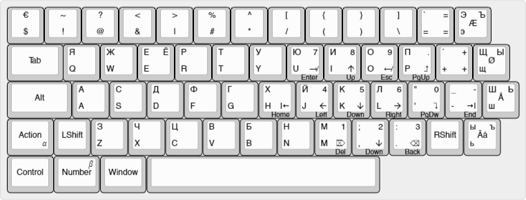

## Keyboard modifications

1. __Alpha (F13)__ and __Beta (F14)__ keys
2. __Smart Left Shift__ works as Ctrl on the left part of keyboards letters
3. Letters on the right part of keyboard is reserved and uses in mappings as soft-keys

## Keyboard mapping

Using US International keyboard to map keyboard keys to my layout ob BLANK keyboard

| From || To ||
| ---- | ------ | ---- | ------ |
| 00_3A | Caps Lock | 00_38 |Left Alt |
| 00_2A | Left Shift | 0064 |F13 __(Alpha)__ |
| 00_56 | ISO extra-key (\\) | 00_2A | __Left Shift__ |
| 00_28 | Single Quot | 00_2A | __Right Shift__ |
| 00_2A | __Right Shift__ | 00_28 | Single Quot |
| E0_5B | Left Windows | 00_65 | F14 __(Beta)__ |
| 00_38 | Left Alt | E0_5B | Left Windows |

## Keybindings

On changes sync the next files:

 * __keybindings.json__ for Visual Studio Code
 * __keybindings.epf__ for Eclipse
 * __keybindings.vssetttings__ for Visual Studio

## Keyboard layout

Layout created on http://www.keyboard-layout-editor.com/ and saved into `keyboard-layout-json.txt`

## Hot-keys

|◆| Key | Action |
| - | ---- | ------ |
|◆| __Ideology__
|| __Ctrl+__ | Command |
|| __Alt+__ | Similar command or anti-command |
|| __+Shift+__ | Expansion/extension/boost  |
|◆| __Arrows__ | _Ctrl+_ has standard behavior in all OS |
|| Alt+Right | To right tab |
|| Alt+Shift+Right | To right group of tabs |
|| Alt+Left | To left tab |
|| Alt+Shift+Left | To left group of tabs |
|| Alt+Up | Move line up |
|| Alt+Down | Move line down |
|◆| __S__
|| Ctrl+S | Save _all_ |
|| Alt+S | Save _as_ |
|◆| __F__
|| Ctrl+F | Find in file |
|| Ctrl+Shift+F | Find in files |
|| Alt+F | Find definition in file _(Ctrl+Mouse)_ |
|| Alt+Shift+F | Find all usages in files |
|◆| __N__
|| Ctrl+N | New file |
|| Ctrl+Shift+N | New folder
|◆| __R__
|| Ctrl+R | Replace in file |
|| Ctrl+Shift+R | Replace in files |
|| Alt+R | Rename |
|◆| __Z__
|| Ctrl+Z | Undo |
|| Ctrl+Shift+Z | Undo all |
|| Alt+Z | Redo |
|| Alt+Shift+Z | Redo all |
|◆| __/__
|| Ctrl+/ | Comment |
|| Alt+/ | Block-Comment |
|◆| __E__
|| Ctrl+E | Edit (open) type by name |
|| Ctrl+Shift+E | Edit (open) resource by name |
|| Alt+E | Selected file <--> (show in) explorer tree |
|◆| __W__
|| Ctrl+W | Close tab |
|| Ctrl+Shift+W | Close all tabs |
|| Alt+W | Open closed tab |
|◆| __Space__
|| Ctrl+Space | Show code helper |
|| Ctrl+Shift+Space | Quick fix |
|◆| __Misc__
|| Ctrl+< | Organize imports |
